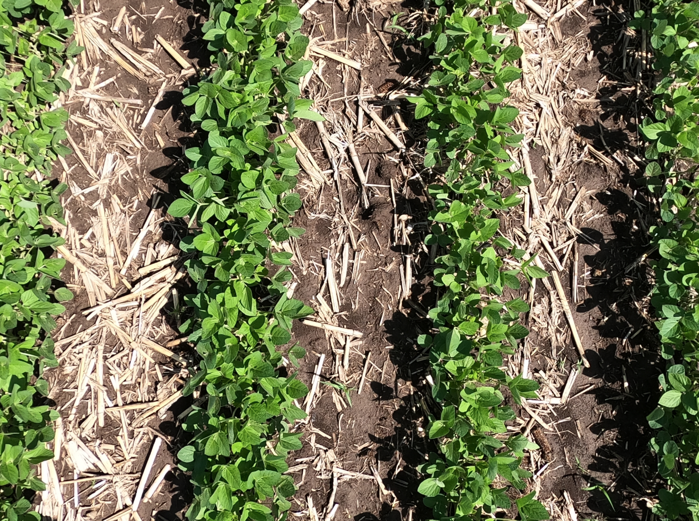

```{r include=FALSE}
library(tidyverse)
library(leaflet)
library(leaflet.providers)
library(leaflet.extras)
library(icons)
library(tidyUSDA)
library(plotly)
# to read https://www150.statcan.gc.ca/n1/pub/95-640-x/2016001/article/14804-eng.htm
# https://www.thecanadianencyclopedia.ca/en/article/agriculture-in-canada#:~:text=Among%20Canada's%20top%20agricultural%20products,agricultural%20products%20in%20the%20world.
```


```{r setup, include=FALSE}
options(htmltools.dir.version = FALSE)
knitr::opts_chunk$set(
  fig.width=9, fig.height=3.5, fig.retina=3,
  out.width = "100%",
  cache = FALSE,
  echo = TRUE,
  message = FALSE, 
  warning = FALSE,
  hiline = TRUE
)
```

```{r xaringan-themer, include=FALSE, warning=FALSE}
#https://www.mcgill.ca/visual-identity/visual-identity-guide#:~:text=McGill%20red%20is%20CMYK%200,B47%20or%20Hexadecimal%20value%20%23ed1b2f.
library(xaringanthemer)
style_duo_accent(
  primary_color = "#1E4D2B",
  title_slide_background_color= "#1E4D2B",
  background_color = "#FFFFFF",
  secondary_color = "#ECC530",
  inverse_header_color = "#59595B"
)
```


```{r meta, echo=FALSE}
library(metathis)
meta() %>%
  meta_general(
    description = "Oliveira's seminar at Colorado State University",
    generator = "xaringan and remark.js"
  ) %>% 
  meta_name("github-repo" = "maxwel/talks") %>% 
  meta_social(
    title = "From field biology to modeling, turning data into smart weed management",
    url = "https://arizona-talk.netlify.app/",
    image = "https://arizona-talk.netlify.app/images/social-card.png",
    image_alt = "",
    og_type = "website",
    twitter_card_type = "summary_large_image",
    twitter_creator = "@maxwelco"
    ) %>% 
   include_meta()
```


```{r features, include=FALSE, warning=FALSE}
xaringanExtra::use_search(show_icon = TRUE,
                          position = "top-left")
xaringanExtra::use_webcam()
#xaringanExtra::use_freezeframe()
xaringanExtra::use_tile_view() # use letter O
xaringanExtra::use_share_again()
xaringanExtra::use_scribble() # use letter S
xaringanExtra::use_fit_screen()
xaringanExtra::use_broadcast() # use P
```


background-image: url(https://source.unsplash.com/ZYmk2tZ1fck)
background-position: right
background-size: contain


## Agenda


- About me

- Research experiences

- Oliveira's lab at Colorado State University


.footnote[Image: Daniel Norris/Unsplash]
---
class: inverse middle center

# About me


---

class: middle, center

## Maxwel Coura Oliveira


[`r icon_style(fontawesome("github"), style = "solid")` @maxwelco](https://github.com/maxwelco)  
[`r icon_style(fontawesome("twitter"), style = "solid")` @maxwelco](https://twitter.com/maxwelco)  
[`r icon_style(fontawesome("link"), style = "solid")` maxweeds.rbind.io](https://maxweeds.rbind.io)  
[`r icon_style(fontawesome("envelope-square"), style = "solid")` maxwelco@gmail.com](mailto:maxwelco@gmail.com)

???

- I am on the social media. Please fee free to follow me

- Describe my social media

- My blog, github, twitter


---

## Background

.pull-left[
- Universidade Federal dos Vales do Jequitinhonha e Mucuri
    
    - BSc in Agronomy 
    
    - MSc in Crop Science (Weed Science)

- University of Nebraska-Lincoln

    - PhD in Weed Science
    
- University of Wisconsin-Madison

    - Post-doc/Research Associate
    
- Western Sao Paulo University

    - Assistant Professor
    
]
    
.pull-right[
```{r echo = FALSE, fig.width=7, fig.height=7, fig.retina=3}
leaflet() %>%
  addTiles() %>%  
  setView(lng = -70, lat = 0, zoom = 3) %>% 
  addProviderTiles(providers$Esri.WorldImagery, group = "Esri World Imagery") %>% 
 addLayersControl(baseGroups = c("OSM", "Esri World Imagery"), 
                   overlayGroups = c("SESYNC"),
                   options = layersControlOptions(collapsed = FALSE))
```
]

???

- Use the map to describe my background

---

# Leisure time

.pull-left[
<center>

</center>
<br>
**Also:** Biking, reading, arts etc
]


.pull-right[
<center>

</center>
]

???

- I would like to add some of my personal activities. 

- When I have free time, I like running, climbing and hiking mountains

- As well as reading, biking, arts, museum etc

---

class: inverse middle center

# Research experiences


---

## Crop-weed interactions

#### Master's research 
.pull-left[


]

.pull-right[


]

.footnote[[Oliveira et al (2018)](https://doi.org/10.1111/wre.12317)]

???

- I would like to start from my master's research. I worked with crop weed competition. 

- I brought here the highlight of my thesis, a paper published at the prestigious Weed Research journal

- This is a recipe paper, whereas I show how to perform a crop weed competition in additive design.

- There are R codes. Everyone is able to run and learn

---

## Weed evolution

#### PhD dissertation

> Evolution of HPPD-inhibitor herbicide resistance in a waterhemp (*Amatanthus tuberculatus* var. *rudis*) population from Nebraska
.pull-left[

]


.pull-right[
<center>

</center>
.footnote[HPPD, 4-Hydroxyphenylpyruvate dioxygenase‑inhibitor]
]

???

- I joined the U of Nebraska in 2014. 

- I was funded by Capes Foundation from Brazil to get a PhD in Nebraska

- I worked with waterhemp, one of the most troublesome weed in the US

---

## Weed evolution

#### The dioecious *Amaranthus* species


.pull-left[
- A plant is either **F**emale or **M**ale

- Rapidly evolves resistance to herbicides

- Two of the most troublesome weed species in the US

- Waterhemp -> US Midwest

- Palmer amaranth (*Amaranthus palmeri*) -> US South
]


.pull-right[
.pull-left[

]
.pull-right[

]
]

???

- I would like to give a background about the pigweed species

- Palmer amaranth is on the left and waterhemp in on the right

- The are dioecious (a plant is either female or male)

- Describe the locations 

---

## Concerns: HPPD-resistance in *Amaranthus* species

- HPPD-resistance (R) in waterhemp and Palmer amaranth biotypes in corn fields across the US Midwest

- Grower reported failure to control waterhemp in Nebraska (Platte Country, 2011)

- **Resistance:** Target site resistance (TSR) or Non-target site resistance (NTSR)

- Gene flow amongst *Amaranthus* species


.pull-left[

]

.pull-right[

]

???

- Talk a bit about the HPPD inhibitors, the bleaching symptoms

- Tell the story about resistance in Nebraska


---

## Weed evolution

#### Confirmation

- Field and greenhouse studies to confirm herbicide (HPPD) weed resistance

.pull-left[

]

.pull-right[
<center>

</center>
]


.footnote[[Oliveira et al (2017)](https://doi.org/10.1017/wet.2016.4)]


???

- My first project was to confirm HPPD-R using greenhouse and field bioassays

- We confirm that the population is R to mesotrione, tembotrione, and topromezone (HPPD herbicides)

---
## Weed evolution

#### What is the mechanism of HPPD-resistance?

<center>

</center>

???

- We had a second question: what is the mechanisms of R in that waterhemp population?

- TSR is well known: a point mutation, gene amplification etc

- NTSR is not well understood: multiple enzymes, metabolic resistance

---


## Weed evolution

#### Investigations on the mechanism of resistance

.pull-left[


PBO, piperonyl butoxide
]

.pull-right[
<center>


</center>
]

.footnote[[Oliveira et al (2018)](https://doi.org/10.1002/ps.4697)]

???

- Describe the study

- Talk about the Cytochrome p450 family

- Striking results

---


## Weed evolution

#### Plant genetic - Inheritance studies 

- Crossing Resistant with Susceptible accessions

.pull-left[
<center>

</center>
]


.pull-right[
<center>

</center>
]

.footnote[[Oliveira et al (2018)](https://doi.org/10.3389/fpls.2018.00060)]

???

- This was a genetic study

- We investigated the inheritance pattern of R in this waterhemp population

- How many genes are involved?

- Results show nuclear inheritance, incomplete dominance and multiple genes playing a role in the resistance


---

## Weed evolution

#### Segregation

<center>

</center>

???

- Describe the table

---

background-image: url(images/geneflow.png)
background-position: right
background-size: contain


## Weed evolution


#### Pollen-mediated gene flow

- Herbicide resistance transfer between pigweed species


- Collaboration between University of Nebraska-Lincoln and Colorado <br>State University

.footnote[[Oliveira et al (2018)]( https://doi.org/10.1111/tpj.14089)]

???

- Show excitement

- Describe the figure first

- We have a hypotheses if these two population could outcross exchange R traits

- We used HPPD-R as a marker

---

## Weed evolution

#### Internal transcribed spacer of the ribosomal coding region

<center>

</center>

.pull-left[
- Double mutation distinct Palmer amaranth from 8 *Amaranthus* species

- KASP assays

- **HEX** and **FAM** fluorescent channels
]

.pull-left[

<center>

</center>
]


???

- KASP, Kompetitive Alleles Specific Polliformism

- We developed a KASP assay to detect Palmer and waterhemp hybrids

- See the double SNP in the ITS of the Ribosomal coding region

---

## Interspecific hybridization


HPPD-**R** waterhemp &#x2192; HPPD-**S** Palmer amaranth


<center>

</center>

???

- These were the results

- We used K-neighboring means with the HEX and FAM channels


---

## Integrated Weed Management

#### University of Nebraska-Lincoln

.pull-left[
- Chemical weed management
<center>

</center>
]

.pull-right[
- Non-chemical weed management
<center>

</center>
]

???

- Describe the other work in Nebraska

- Talk about the IWM projects

- Interns, awards, meetings WSSA/NCWSS

---

## Integrated Weed Management

#### University of Nebraska-Lincoln

- Critical time for weed removal


.pull-left[

]

.pull-right[

]

???

- Describe this project: multiple sites and years across Nebraska

- Combinations of tactics to manage weeds

---

## University of Wisconsin-Madison

.pull-left[
- Experienced and helped with the established of a new *Research* and *Extension* program

- Herbicide evaluation

- Support Research and Extension staff

- Seven graduate students/visiting students

- NCWSS and WSSA's meetings/student weed contests
]

.pull-right[
<center>

</center>

]

???

- Describe my moving to WI

- Tell that it was a novel program

- We had to hire studens and staff


---
background-image: url(images/smoke.jpeg)
background-position: right
background-size: contain


## Integrated Weed Management

#### Novel herbicide resistance traits

- Dicamba and 2,4-D resistant crops

- Drift evaluation

- Support EPA's decisions


.footnote[Source: [Soltani et al. (2020)](https://doi.org/10.1017/wet.2020.17) and [Werle et al. (2021)](https://doi.org/10.1017/wet.2021.62)]

???

- Describe the projects

- Tell about the project together with U of Gelph

---

## Integrated Weed Management

#### Cover Crops

.pull-left[
- Adapted cover crop species in Wisconsin

- Termination timing and methods

- Impact of residual herbicides on cover crop species and vice versa

- Survey of cover crop adoption and management

]


.pull-right[

]


.footnote[Image: Rodrigo Werle]

???

- Tell the importance of cover crops for IWM

- We had a MSc student working in this project

---

## Integrated Weed Management

#### Row-width manipulation

.pull-left[

]

.pull-right[

]

.footnote[Image: Nikola Arsenijevic / UW-Madison]

???

- Tell the importance of row width for IWM

- We had a MSc student working in this project

---
background-image: url(images/pms.png)
background-position: right
background-size: contain
## Application technology

#### Drift mitigation


---

## Weed ecology

#### Palmer adaptation to the north central US

.pull-left[

]


.pull-right[

]


.footnote[Image: Paper accepted at Frontiers in Agronomy]

???

- Describe the study

---

## Weed ecology

#### Weed emergence

.pull-left[
- Understand weed emergence to implement best management practices

  - Giant ragweed emergence in Wisconsin (Striegel et al 2021)
  
  - Horseweed emergence in Nebraska
]

.pull-right[


]


???

- Understanding weed biology is important for minimizing weed impact to agroecosystem

---

background-image: url(images/max.jpeg)
background-position: right
background-size: contain 

## University of Wisconsin-Madison


???

- Field days and talks across Wisconsin

---


## University of Wisconsin-Madison

<center>

</center>

???

- This was the Wisconsin Weeds Team in 2019

- Prior to the pandemic

---

## Western Sao Paulo University

.pull-left[
- Teaching
  - Integrated Weed Management
  - Wheat
  - Programming in R

- Graduate and undergraduate students

- Integrated Weed Management in cotton

  - Pre-emergence herbicides
  - Critical time for weed control
  
- Integrated Weed Management survey in Western Sao Paulo
]


.pull-right[
<center>

</center>
]

???

- My first year in Brazil I have the chance to work in a University....

---
background-image: url(https://source.unsplash.com/1LLh8k2_YFk)
background-position: right
background-size: contain

## Data science

- **Languages**: [`r icon_style(fontawesome("r-project"), style = "solid")`](https://www.r-project.org/),
[<span class="latex">L<sup>a</sup>T<sub>e</sub>X</span>](https://www.latex-project.org/), [`r icon_style(fontawesome("css3"), style = "solid")`](https://www.w3.org/Style/CSS/Overview.en.html), [`r icon_style(fontawesome("html5"), style = "solid")`](https://www.w3schools.com/html/html_intro.asp), [`r icon_style(fontawesome("markdown"), style = "solid")`](https://www.markdownguide.org/)

- GitHub `r icon_style(fontawesome("github"), style = "solid")`

- R tidyverse [instructor](https://education.rstudio.com/trainers/people/oliveira+maxwel/)

- Data [visualization](https://github.com/maxwelco/Tidy-Tuesday) 📊

- Statistical modeling 📈

- Blog - [maxweeds](https://maxweeds.rbind.io/) and [Open Weed Science](https://www.openweedsci.org/)

- Manuscripts 📜

- Shiny [app](https://maxwelco1.shinyapps.io/fundamax/)

.footnote[Image: Markus Spiske/Unsplash]


---

class: inverse middle center

# Oliveira's lab at


<center>

</center>


---

## Colorado

.pull-left[

<center>

</center>
]

.pull-right[

- Quebec leads the organic sector in Canada
    - 9% of Quebec farms certified organic
    - Many more currently transitioning to organics

- Minister of Agriculture (MAPAQ) plans to double the number of organic farms by 2025

]

---


## Weed evolution 

<center>

</center>


???
- birdsrape mustard (*Brassica rapa*)

- common lambsquarters (*Chenopodium album*)

- common ragweed (*Ambrosia artemisiifolia*)
]

.pull-right[
- Powell amaranth (*Amaranthus powellii*)

- redroot pigweed (*Amaranthus retroflexus*)

- wild oat (*Avena fatua*)

- There are 17 cases of resistance


---

## Integrated Weed Management

.pull-left[
- **Integrated weed management** is no longer a nice idea

- **Integrated weed management** is "the solution"
<center>

</center>
]

.pull-right[
- Weed management: **heavily** based on herbicides


<center>

</center>
.footnote[Image: UNL]
]

---

## My research program at Colorado State University (Short-term)

#### Better understand herbicide resistance/most common/troublesome species in Colorado

.pull-left[
> **RQ** - What is the current resistance scenario in Colorado?
  
- **Approach** - Surveys, monitoring, quick diagnoses
]

.pull-right[
> **RQ** - What are the resistance drivers/mechanisms?
- **Approach** - Investigate known and unravel new resistance mechanisms 
]

--

#### Understanding weed biology to improve weed management

.pull-left[
> **RQ** - How do weed populations shift in response to weed management practices?
  
- **Approach** - Measure biological variables as influenced by management practices
]

.pull-right[
> **RQ** - Can we use effective non-chemical and site-specific weed management?
- **Approach** - Investigate non-chemical and site-specific tactics that minimize weed impact to cropping systems
]

---

## My research program at Colorado State University (Long-term)

#### Adopting epidemiological approach to understand weed population dynamics

.pull-left[
> **RQ** - What are the main factors that make weeds endemic?
  
- **Approach** - Genomics, agronomic, and environmental metadata; data science, statistics etc
]

.pull-right[
> **RQ** - What is the best integrated weed management strategies for Colorado?
- **Approach** - Collect data and validate in the field weed management strategies that minimize weed impact to cropping systems
]

--

.pull-left[
> **RQ** - Do changes in precipitation, temperature and CO<sub>2</sub> reduce weed control?
  
- **Approach** - Measured plant development and herbicide degradation under stress condition etc
]

.pull-right[
> **RQ** - Do changes in precipitation, temperature and CO<sub>2</sub> increase weed invasiveness?
- **Approach** - Plant adaptation, measure ecological and biological weed traits; Big data analytics
]

---

## My research program at Colorado State University

#### Smart Weed Management

.pull-left[
- Coordinated and Sustained Interdisciplinary Research

- Fundamental and applied research

- Network of experiments across Colorado / USA / North America

- Participatory research to guide priorities

- Build capacity and sustainable research programs

- Economic and social science research

- Understand human behavior and the drivers of decisions

- Education and outreach
]

.pull-right[
<center>

</center>
]


---

## Team work

.pull-left[
- Research technologists

- Undergraduate students

- Graduate students

- Postdoctoral research associates

- Visiting scientists
]

.pull-right[
<center>

</center>

.footnote[Image: CSU Weed Lab "All hands on deck"]

]


---

## Collaborations

.pull-left[
- Faculty

- Staff 

- Students

- Public
]

.pull-right[
<center>

</center>

]


---

## Collaborations


.pull-left[
<center>


<br><br>


<br><br>


</center>
]


.pull-right[
<center>


<br>


</center>
]


---

## Funding / Collaborations

.pull-left[
<center>

</center>
<br>
<center>

</center>
]


.pull-right[

<center>

</center>
<br><br>
<center>

</center>
]


---

## Publications

<center>


</center>

---

name: goodbye
class: right, middle, blue


# Thank you!

#### You can find me at...

[`r icon_style(fontawesome("github"), style = "solid")` @maxwelco](https://github.com/maxwelco)  
[`r icon_style(fontawesome("twitter"), style = "solid")` @maxwelco](https://twitter.com/maxwelco)  
[`r icon_style(fontawesome("link"), style = "solid")` maxweeds.rbind.io](https://maxweeds.rbind.io)  
[`r icon_style(fontawesome("envelope-square"), style = "solid")` maxwelco@gmail.com](mailto:maxwelco@gmail.com)
